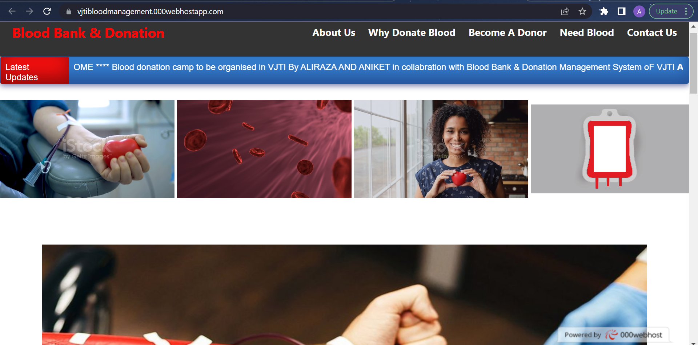
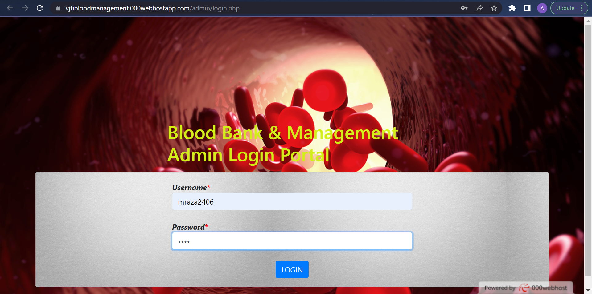
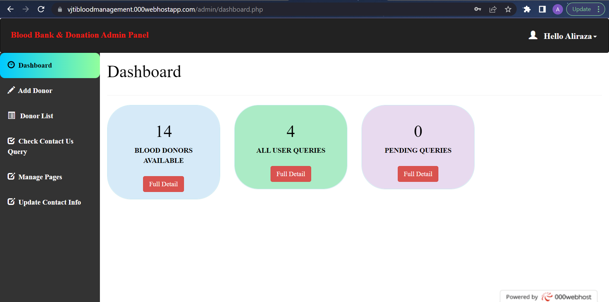

# Blood Donation Management System

Blood Donation Management System is a php based web project with both admin and user layouts used by VJTI students inorder to collect the information regarding donors and recipients of the blood in the college campus.

## User Section

User interface consists of all the required information for the user to know regarding blood donation and also he/she can register for the blood donation campign through this interface.

## Admin Section

Admin interface primarily requires admin credentials to login into the admin section. After login, admin can see the dashboard which contains the details of the donors, blood type available and any queries to be answered from user side. Admin has the power to add and delete the information of the donor and it also maintains and approves the data of the blood type available.

Admin Credential :

- Username : mraza2406
- Password : 1234

